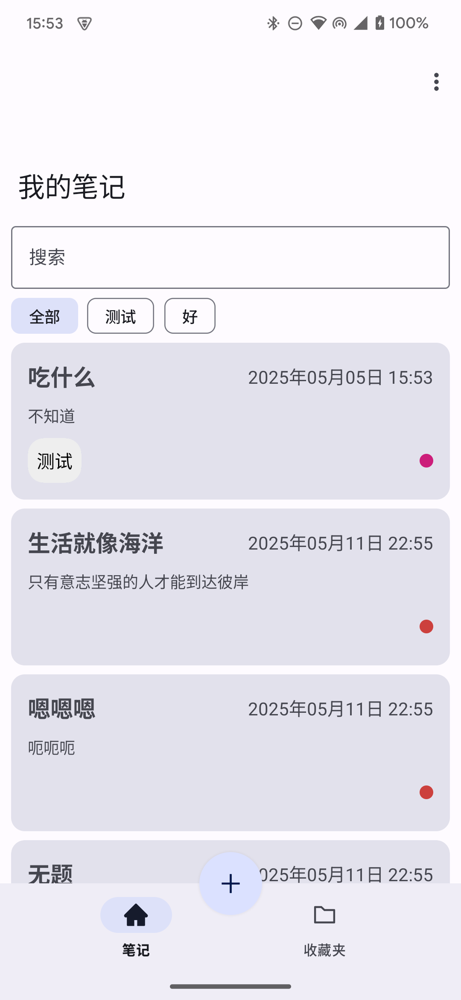
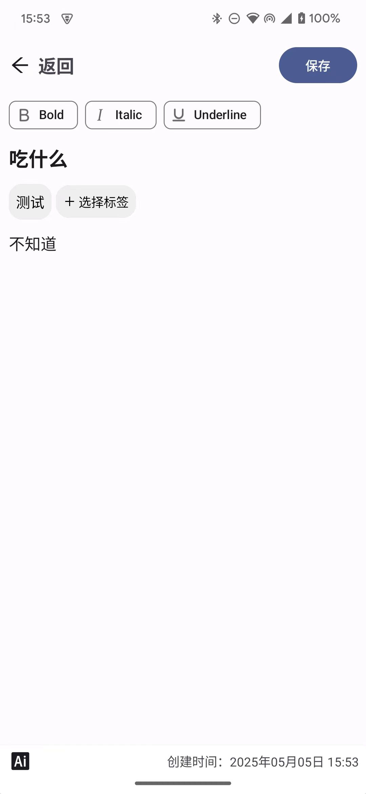

<p align="center">
  
  
  
</p>


<h1 align="center">📝 NoteTest</h1>
<p align="center">基于 XML + Kotlin 的极简笔记本应用</p>

---

### ✨ 特性

- **极简设计**：无冗余功能，专注笔记核心体验  
- **本地存储**：Room保障数据隐私  
- **Material 3**：动态色彩与优雅动效  

---

### 🛠️ 技术栈

```kotlin
- "Kotlin Coroutines"
- "ViewModel"
- "Room"
- "Jetpack Navigation"
```

### 🖼️ 界面预览

| 笔记列表                                                     | 编辑界面                                                     |
| :----------------------------------------------------------- | :----------------------------------------------------------- |
|  |  |


### 🎨功能较为简单，仅供参考学习，大佬嘴下留情

